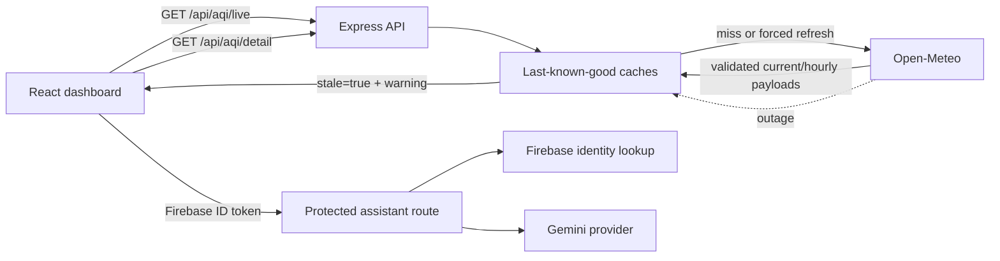

# Aetherion Architecture and Contribution Guide

## Design goals

Aetherion presents modeled air-quality data without implying that it is a regulatory sensor. The application favors transparent freshness, graceful degradation, bounded in-memory state, and shared domain logic that can be tested without starting the web server.

## System boundaries

## Architectural decisions

### Last-known-good data

`LastKnownGoodCache` stores only successful provider results. A normal request uses a fresh five-minute snapshot. A forced refresh reaches Open-Meteo immediately. If that call fails and a prior snapshot exists, the API returns it with `meta.stale`, `meta.staleAgeMinutes`, and a human-readable warning. The UI never hides that degradation.

Forecasts use the same behavior with a per-city, 15-minute cache. The monitored city list bounds the number of forecast caches.

### Bounded rate limiting

The assistant uses a 60-second sliding window. Each IP retains at most 100 timestamps, idle entries are removed after the window, and the store retains at most 1,000 IP buckets using oldest-seen eviction. This keeps memory usage bounded during long-running sessions.

### Runtime validation

Open-Meteo is an external trust boundary. `src/server/open-meteo.ts` converts unknown JSON into typed current readings and forecast points. Invalid values are discarded before they reach the domain model.

### Shared domain contracts

All AQI, forecast, API metadata, and assistant-context contracts live in `src/lib/types.ts`. Forecast summary calculations live in `src/lib/forecast-metrics.ts`. Both client screens import the same implementation.

### Configuration and secrets

The repository contains only `.env.example`. Server-only values use `process.env`; browser-safe Firebase project identifiers use `VITE_FIREBASE_*` variables injected by Vite. Real `.env` files are ignored. Gemini credentials never enter the browser bundle.

## Data freshness contract

`GET /api/aqi/live` returns:

- `results`: validated modeled city readings
- `meta.timestamp`: API response time
- `meta.dataTimestamp`: newest provider observation time
- `meta.stale`: whether the provider failed and cached data was used
- `meta.staleAgeMinutes`: age of the cached snapshot
- `meta.warning`: partial-provider or stale-data explanation

Consumers must display the stale state and retain the provider disclaimer.

## Contribution workflow

1. Create a branch from current `main`.
2. Copy `.env.example` to `.env.local` and supply your own Firebase and optional Gemini configuration.
3. Run `npm install`.
4. Make focused changes and add tests for domain or server logic.
5. Run `npm run check` before opening a pull request.
6. Document new API fields or architectural decisions here.

Pull requests should explain user impact, failure behavior, and the checks used to validate the change. Never commit `.env.local`, service-account files, tokens, or provider credentials.

## Verification policy

`npm run check` runs strict TypeScript validation, ESLint, Vitest with enforced 90% thresholds for testable domain/server modules, and a production Vite build. UI components remain covered by type-checking and the production build; critical calculations, provider guards, cache behavior, and rate-limit behavior are unit tested.
